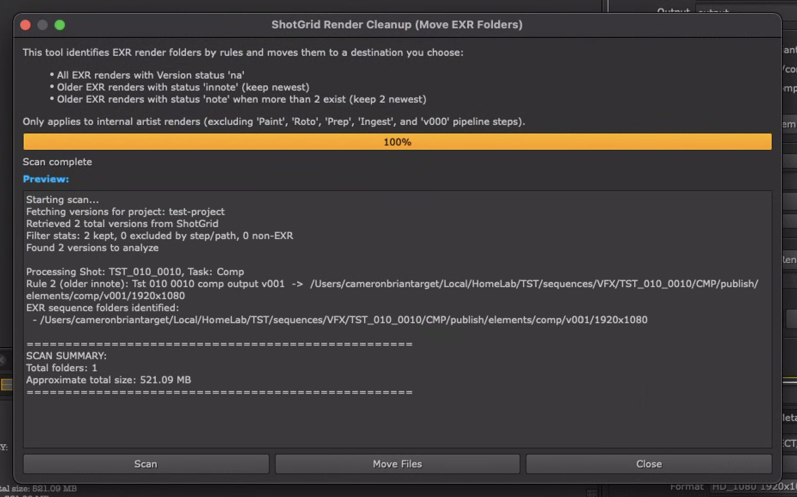

## ShotGrid Render Cleanup Script

A Nuke tool that finds and moves EXR render folders based on ShotGrid version status rules. It gives you a Qt dialog for scanning, previewing results, and moving folders to an archive destination.

---

## Overview

When working on VFX projects, large EXR renders can quickly build up on local disks. This script:

- Connects to your current ShotGrid project context.
- Scans all **.exr** sequences for versions in ShotGrid.
- Applies three cleanup rules based on version status in ShotGrid.
- Presents results in a Qt dialog for review.
- Moves identified EXR sequence folders to a destination you choose.

---

## Prerequisites

- **Nuke** (with Python API)
- **ShotGrid Toolkit** (to obtain `sg`, `engine`, and `context`; must be running from within a Toolkit hook or engine)
- Python modules:
  - `PySide6`, `PySide2`, or `PySide` (auto-detects available version)
  - Standard library: `os`, `sys`, `shutil`, `logging`, `collections`, `traceback`

Make sure your Nuke launcher has access to the same Python environment where ShotGrid Toolkit is installed.

---

## Installation

1. Copy the script file (`clean-up.py`) into your Nuke plugin path or Toolkit hook folder.
2. Add a menu item in your `menu.py`
3. Alternative: **Use** Cragl smartScripter tool to keep track of python script in Nuke.

---

## Usage

### Running from Script Editor

Copy and paste the `clean-up.py` contents into the Nuke script editor while in the appropriate SG toolkit context. Run from there.

### Dialog Workflow

1. **Info Panel**
   - Summarizes the three cleanup rules and pipeline step exclusions.
2. **Scan Button**
   - Fetches versions from ShotGrid, groups by shot/task, applies rules.
   - Updates progress bar and logs each candidate path.
   - Shows total folder count and approximate size.
3. **Preview Text Area**
   - Shows each EXR sequence folder that will be moved and a summary.
4. **Move Files Button**
   - Only enabled after a scan.
   - Prompts for destination folder.
   - Moves all identified folders to the destination in a flat structure.
   - Handles naming conflicts by appending numbers (_1, _2, etc.).
5. **Close Button**
   - Exits the dialog.

---

## Cleanup Rules

1. **Rule 1 – "na" Status**
   Move **all** EXR renders for versions whose `sg_status_list == "na"`.

2. **Rule 2 – "innote" Status**
   On any shot/task with **multiple** `"innote"` (internal note) versions, move all **older** frame sequences, preserving only the **newest** `"innote"` version.

3. **Rule 3 – "note" Status**
   On any shot/task with **more than 2** `"note"` (client note) versions, move all but the **two newest** `"note"` versions.

> Only applies to internal artist renders. Versions belonging to excluded pipeline steps (`Roto`, `Paint`, `Prep`, `Ingest`, `v000`) are filtered out before applying rules.

---

## File Operations

- **Archive Structure**: All moved folders are placed in a flat structure under your chosen destination directory.
- **Conflict Resolution**: If a folder name already exists in the destination, it will be renamed with a numeric suffix (_1, _2, etc.).
- **Progress Tracking**: Real-time progress updates during the move operation.
- **Size Calculation**: Displays approximate total size of data to be moved during scan.

---

## Logging

- All operations are reported at `INFO` level.
- Filter statistics (kept vs. excluded vs. non-EXR) are displayed after version retrieval.
- Each move candidate is logged with the rule that triggered it.
- Move operations show source and destination paths.
- Errors include full stack traces in the UI and console.

---

## Error Handling

- **Missing Toolkit / Context**
  Prompts Nuke message: "No ShotGrid engine found…"
- **UI Build Errors**
  Catches exceptions around widget creation; reports via `nuke.message()`.
- **Scan/Move Exceptions**
  Logged and shown in the dialog; buttons re-enabled to allow retry.
- **Missing Files**
  Paths that no longer exist on the file system are skipped with warnings.

---

## Extending or Customizing

- **Add New Rules**
  Extend `apply_cleanup_rules()` method and update the UI info text.
- **Change Excluded Steps**
  Modify `self.excluded_pipeline_steps` in the `RenderCleanup` initializer.
- **Alternate File Types**
  Adjust the `.exr` filter in `get_versions_for_cleanup()`.
- **Different Archive Structure**
  Modify the `move_files()` method to organize moved folders differently.
